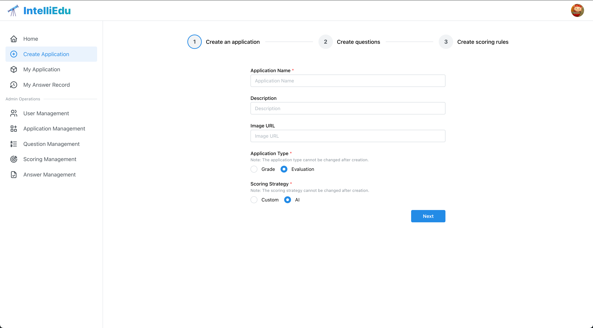
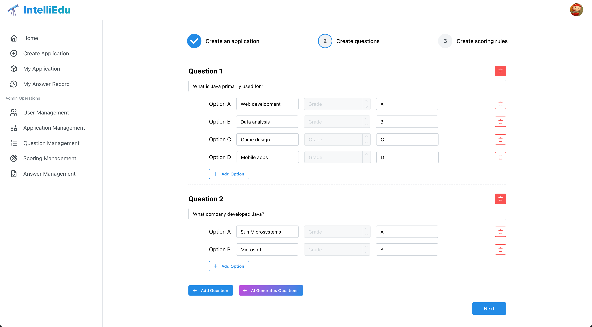
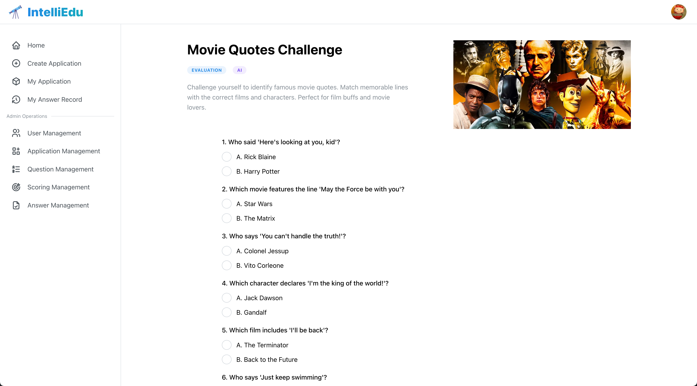
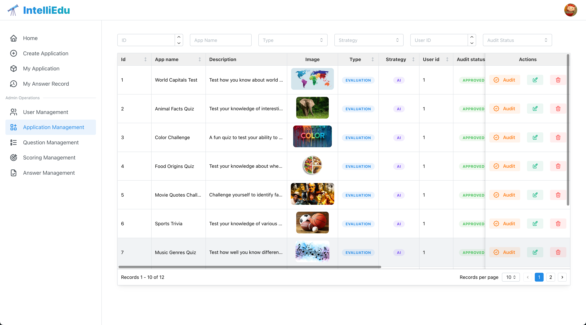

## Introduction

An Intelligent Quiz Platform built with Vite, React and Mantine.

## Preview

Home


Create an application



Create Questions



Take Quiz



AI Scoring Result


Application management



## Development Guide

### Dependencies

This project uses the following dependencies:


| Dependency       | Version |
| ---------------- | ------- |
| Node.js          | 18.20.2 |
| pnpm             | 9.1.0   |
| vite             | ^5.4.0  |
| react            | ^18.3.1 |
| react-router-dom | ^6.26.0 |
| mantine          | ^7.12.0 |

### Getting Started

Install dependencies:

```bash
pnpm install
```

Start the development server:

```bash
pnpm dev
```

Your application will be available at http://localhost:5173 by default.

## Deployment Guide

This project is deployed on [Vercel](https://vercel.com/), which provides:
* Automated CI/CD pipeline
* Global CDN distribution
* Automatic HTTPS certification

To handle client-side routing and prevent 404 errors on page refresh, add the following `vercel.json` to your project root:

```js
{
  "rewrites": [
    {
      "source": "/(.*)",
      "destination": "/index.html"
    }
  ]
}
```
